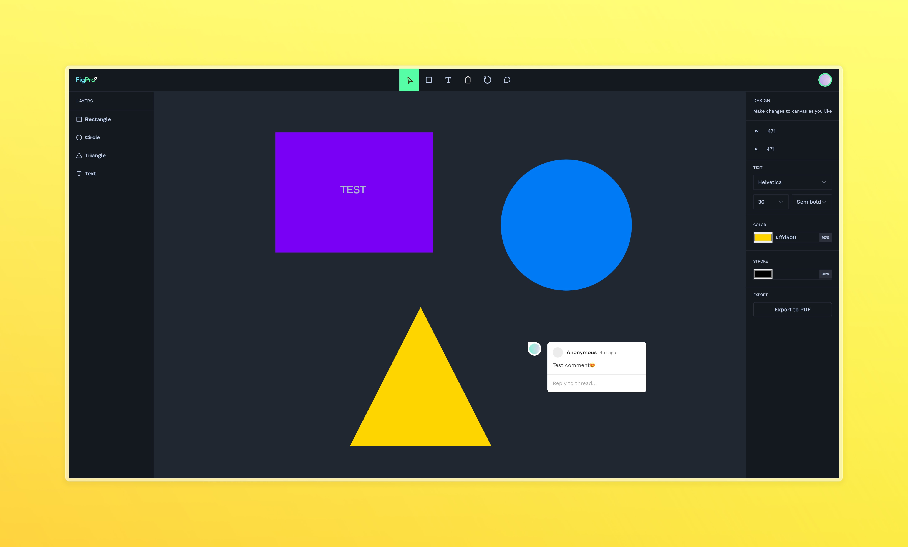

# FigPro - A Figma Clone



<div align="center">
  
  
  
  
  
</div>

## 🎨 Overview

FigPro is a Figma clone built with modern web technologies. This project demonstrates real-time collaborative design capabilities using Liveblocks, with a powerful canvas implementation using Fabric.js.

## ✨ Features

- 🎨 Real-time collaborative canvas
- 🖼️ Shape creation and manipulation
- 👥 Multi-user cursors
- 💬 Real-time comments
- 📱 Responsive design
- 🎯 Advanced shape controls
- 💾 Export to PDF functionality

## 🛠️ Tech Stack

- **Framework:** Next.js 14
- **Language:** TypeScript
- **Styling:** Tailwind CSS
- **Canvas Library:** Fabric.js
- **UI Components:** Radix UI
- **Real-time Collaboration:** Liveblocks
- **PDF Export:** jsPDF

## 🚀 Getting Started

1. Clone the repository:
```bash
git clone https://github.com/pakagronglb/figpro-figma-clone.git
```
2. Install dependencies:
```bash
npm install
```
3. Create a `.env` file and add your environment variables:
```env
NEXT_PUBLIC_LIVEBLOCKS_PUBLIC_KEY=your_liveblocks_public_key
```

## 🧰 Project Structure
```bash
README.md
figpro-figma-clone/
├── app/
│ ├── layout.tsx
│ └── page.tsx
├── components/
├── lib/
└── public/
```

## 🤝 Contributing

Contributions, issues, and feature requests are welcome!

## 📜 License

This project is licensed under the MIT License.

## 🙏 Acknowledgments

This project was built following the tutorial by [JavaScript Mastery](https://www.youtube.com/watch?v=oKIThIihv60). Special thanks to Adrian for the excellent guidance and teaching.

## 📫 Contact

For any questions or feedback, please reach out to [your contact information].

---
<div align="center">
  <sub>Built with ❤️ by Pakagrong</sub>
</div>
